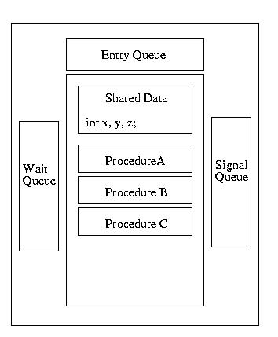

### Monitors
  A monitor is a synchronization tool designed to make a programmer's life simple. A monitor can be thought of as a conceptual box. A programmer can put functions/procedures/methods into this box and the monitor makes him a very simple guarantee: only one function within the monitor will execute at a time -- mutual exclusion will be guaranteed.
Furthermore, the monitor can protect shared data. Data items declared within the monitor can only be accessed by functions/procedures/methods within the monitor. Therefore mutual exclusion is guaranteed for these data items. Functions/procedures/methods outside of the monitor can not corrupt them.

If nothing is executing within the monitor, a thread can execute one of its procedures/methods/functions. Otherwise, the thread is put into the entry queue and put to sleep. As soon as a thread exits the monitor, it wakes up the next process in the entry queue.

